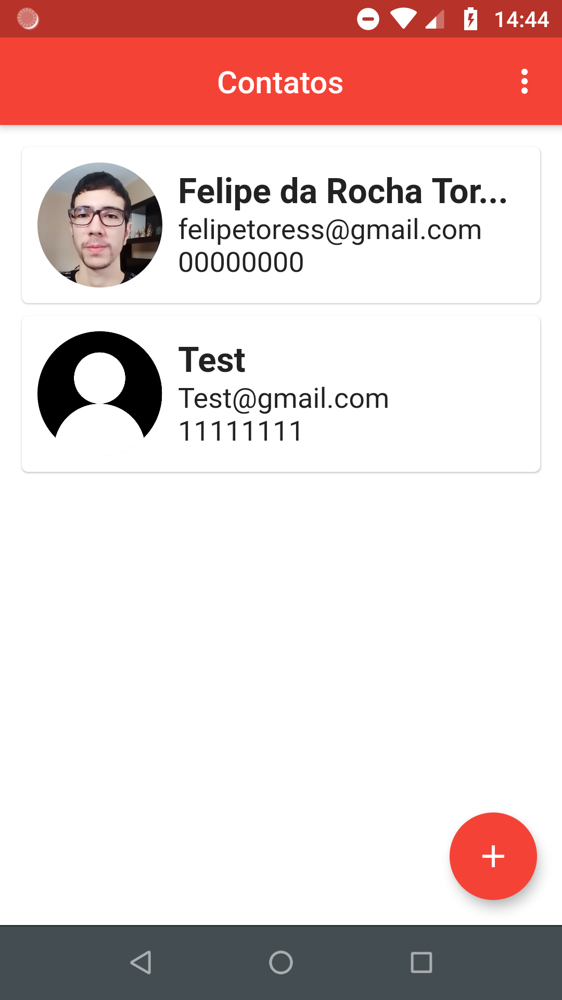
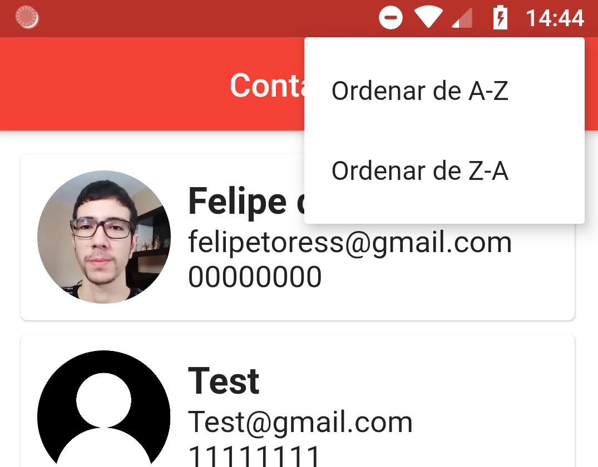
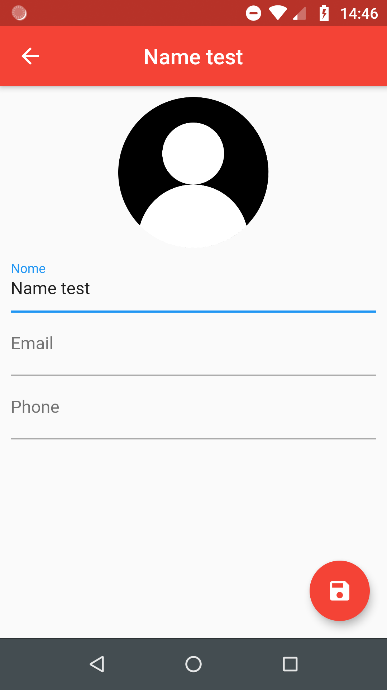
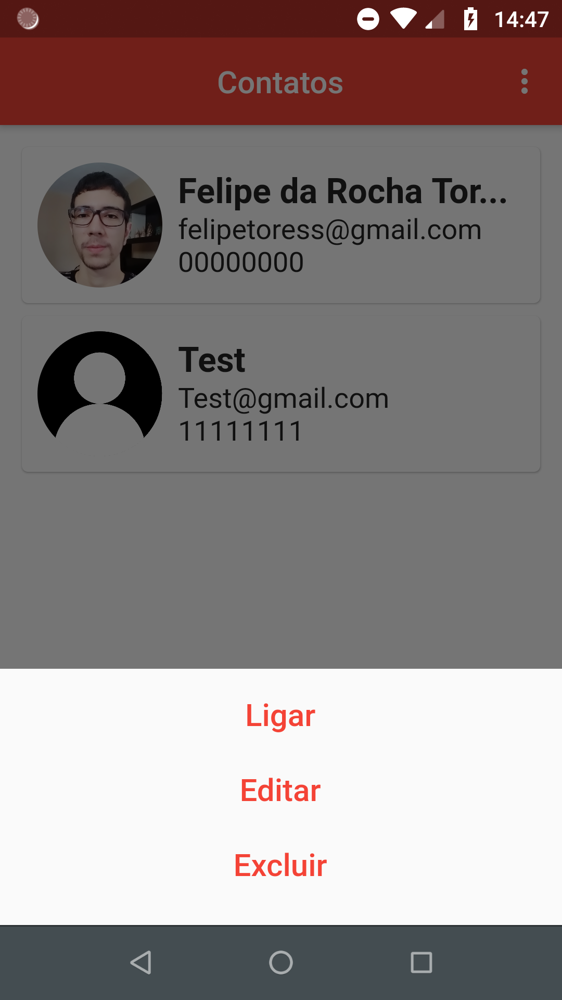
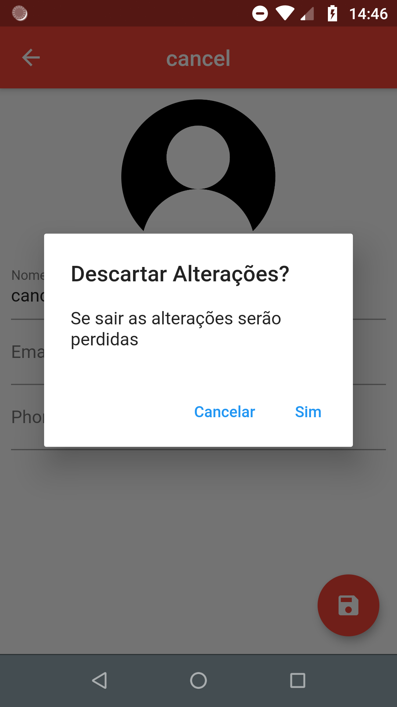
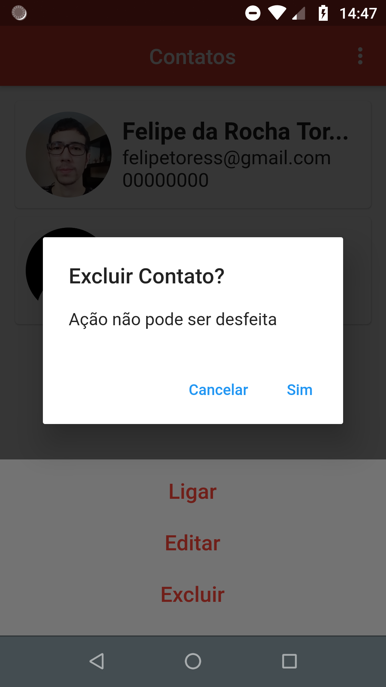

# Phone Book 
Repository for project Phone Book

# Description
the application works as a phone book.

# Technologies
The application was full developed using flutter.

# Screenshots

# Main Screen

# Main Screen Organization

# Contact Screen

# Contact Options

# Security Alerts

  
  

## Getting Started

This project is a starting point for a Flutter application.

A few resources to get you started if this is your first Flutter project:

- [Lab: Write your first Flutter app](https://flutter.dev/docs/get-started/codelab)
- [Cookbook: Useful Flutter samples](https://flutter.dev/docs/cookbook)

For help getting started with Flutter, view our
[online documentation](https://flutter.dev/docs), which offers tutorials,
samples, guidance on mobile development, and a full API reference.
